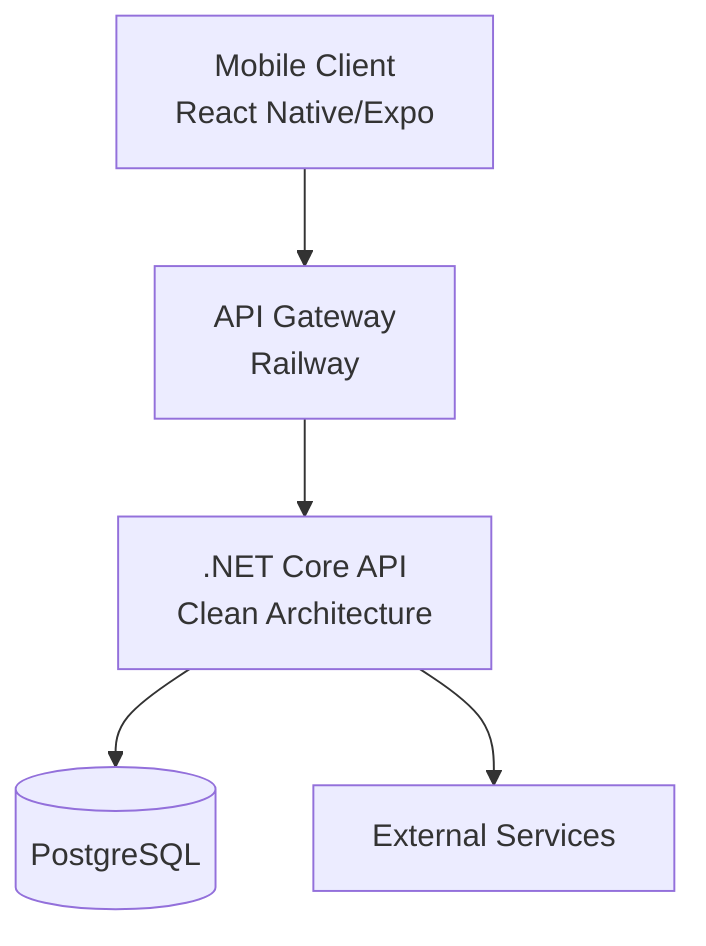

# ✂️ Barber Flow

Barbershop management system with **React Native (Expo)** frontend and **.NET Core 8** backend, deployed on **Railway** with **CI/CD via GitHub Actions**.

[](https://expo.dev)
[](https://reactnative.dev)
[](https://dotnet.microsoft.com)
[](https://railway.app)

---

## 📑 Table of Contents
- [✨ Features](#-features)
- [🏗️ Architecture](#️-architecture)
- [📱 Frontend (Mobile)](#-frontend-mobile)
  - [Prerequisites](#prerequisites)
  - [Installation](#installation)
  - [Running the app](#running-the-app)
  - [Available scripts](#available-scripts)
  - [Folder structure](#folder-structure)
- [🖥️ Backend (API)](#️-backend-api)
  - [Prerequisites](#prerequisites-1)
  - [Installation](#installation-1)
  - [Running the app](#running-the-app-1)
  - [Database](#database)
  - [Folder structure](#folder-structure-1)
- [🔐 Environment Variables](#-environment-variables)
- [🚀 Deployment](#-deployment)
- [🧪 Testing](#-testing)
- [📚 API Documentation](#-api-documentation)
- [🤖 AI-Powered Development](#-ai-powered-development)
- [🤝 Contributing](#-contributing)
- [📄 License](#-license)

---

## ✨ Features

### Frontend
- 📅 Interactive calendar for appointment management
- 👤 User authentication (customers/barbers)
- 🔔 Push notifications
- 🎨 Light/Dark theme system
- 📱 Responsive design for iOS and Android
- ⚡ Global state management with Zustand
- 🧭 Drawer + Stack navigation

### Backend
- 🏛️ Clean Architecture
- 🔐 JWT Authentication
- 📦 Entity Framework Core with PostgreSQL
- ✅ FluentValidation for input validation
- 📄 Swagger documentation
- 🐳 Dockerized for production
- 🔄 CI/CD with GitHub Actions

---

## 🏗️ Architecture



---

## 📱 Frontend (Mobile)

### Prerequisites
- Node.js 18 or higher
- npm or yarn
- Expo CLI (`npm install -g expo-cli`)
- iOS Simulator (Mac only) or Android Emulator
- Expo Go app on your physical device (optional)

### Installation
```bash
# Clone the repository
git clone https://github.com/your-username/barber-flow.git
cd barber-flow/barber-flow-mobile

# Install dependencies
npm install
```

### Running the app
```bash
# Development mode
npm start

# Run on specific platforms
npm run android    # Android emulator/device
npm run ios        # iOS simulator (Mac only)
npm run web        # Web version (limited)

# Different environment modes
npm run dev        # Development
npm run preview    # Pre-production
```

### Available scripts
| Command | Description |
|---------|-------------|
| `npm start` | Start Expo development server |
| `npm run android` | Run on Android |
| `npm run ios` | Run on iOS |
| `npm run web` | Run web version |
| `npm run lint` | Run linter |
| `npm test` | Run tests |
| `npm run build:android` | Production build (APK/AAB) |
| `npm run build:ios` | Production build (IPA) |
| `npm run build:preview` | Pre-production build |

### Folder structure
```
src/
├── components/           # Reusable components
│   ├── calendar/        # Calendar-specific components
│   ├── settings/        # Settings components
│   └── ui/              # Base components (Button, Card, etc.)
├── context/             # React Contexts
│   └── NotificationContext.tsx
├── features/            # Feature-based organization
│   └── appointments/
│       ├── appointment.store.ts
│       └── appointment.types.ts
├── navigation/          # Navigation configuration
│   ├── AppNavigator.tsx
│   └── DrawerNavigation.tsx
├── screens/             # Screens
│   ├── CalendarScreen.tsx
│   ├── CreateAppointmentScreen.tsx
│   ├── NotificationScreen.tsx
│   └── SettingsScreen.tsx
├── services/            # API calls
├── store/               # Global Zustand stores
└── theme/               # Theme system
    ├── fonts.ts
    ├── ThemeContext.tsx
    └── themes.ts
```

---

## 🖥️ Backend (API)

### Prerequisites
- [.NET SDK 8.0](https://dotnet.microsoft.com/download)
- [PostgreSQL](https://www.postgresql.org/download/) (local or Docker)
- [Docker](https://www.docker.com/products/docker-desktop) (optional)

### Installation
```bash
cd barber-flow/barber-flow-api

# Restore dependencies
dotnet restore

# Install EF Core tools (if not installed)
dotnet tool install --global dotnet-ef
```

### Running the app
```bash
# Run in development
dotnet run --project Barber.Flow.Api

# Or from the API folder
cd Barber.Flow.Api
dotnet run

# With hot reload
dotnet watch run
```

### Database
```bash
# Create migration
dotnet ef migrations add InitialCreate --project Barber.Flow.Infrastructure --startup-project Barber.Flow.Api

# Apply migrations
dotnet ef database update --project Barber.Flow.Infrastructure --startup-project Barber.Flow.Api

# Remove migration
dotnet ef migrations remove --project Barber.Flow.Infrastructure --startup-project Barber.Flow.Api
```

### Folder structure
```
Barber.Flow.Api/
├── Barber.Flow.Domain/           # Entities, Enums, Interfaces (no dependencies)
│   └── Entities/
│       ├── Appointment.cs
│       └── User.cs
├── Barber.Flow.Application/       # DTOs, Use Cases, Validators
│   ├── DTOs/
│   ├── Validators/
│   └── Services/
├── Barber.Flow.Infrastructure/    # DbContext, Repositories, Migrations
│   ├── Data/
│   └── Repositories/
└── Barber.Flow.Api/              # Controllers, Middleware, Program.cs
    ├── Controllers/
    ├── Middleware/
    └── Program.cs
```

---

## 🔐 Environment Variables

### Frontend (`.env`)
```env
# API URL (Railway)
EXPO_PUBLIC_API_URL=https://your-api.railway.app/api

# Environment
EXPO_PUBLIC_ENV=development
```

### Backend (`appsettings.json` or Railway)
```json
{
  "ConnectionStrings": {
    "DefaultConnection": "Host=localhost;Port=5432;Database=barberflow;Username=postgres;Password=your_password"
  },
  "Jwt": {
    "Key": "your_very_long_and_secure_secret_key",
    "Issuer": "BarberFlow",
    "Audience": "BarberFlowMobile",
    "ExpiresInMinutes": 60
  },
  "Logging": {
    "LogLevel": {
      "Default": "Information",
      "Microsoft": "Warning"
    }
  }
}
```

---

## 🚀 Deployment

### Frontend (Expo EAS)
```bash
# Install EAS CLI
npm install -g eas-cli

# Configure build
eas build:configure

# Production build
eas build -p android --profile production
eas build -p ios --profile production
```

### Backend (Railway)

The project includes Railway-ready configuration:

1. Connect repository to Railway
2. Configure environment variables in Railway
3. Railway automatically detects the Dockerfile
4. Automatic deployment on push to `main`

**Included files:**
- `Dockerfile` - Container configuration
- `.dockerignore` - Ignored files
- `railway.json` - Railway-specific configuration

### CI/CD (GitHub Actions)
The project includes automated workflow:
- `.github/workflows/deploy.yml`
- Runs tests on every PR
- Deploys to Railway on merge to `main`

---

## 🧪 Testing

### Frontend
```bash
# Run tests
npm test

# Watch mode
npm test -- --watch

# Coverage
npm test -- --coverage
```

### Backend
```bash
# Run all tests
dotnet test

# Tests with coverage
dotnet test --collect:"XPlat Code Coverage"

# View report
reportgenerator -reports:"**/coverage.cobertura.xml" -targetdir:"coveragereport" -reporttypes:Html
```

---

## 📚 API Documentation

Once the backend is running, Swagger documentation is available at:

- Local: `https://localhost:5001/swagger`
- Production: `https://your-api.railway.app/swagger`

**Main endpoints:**
- `POST /api/auth/login` - Authentication
- `POST /api/auth/register` - Registration
- `GET /api/appointments` - List appointments
- `POST /api/appointments` - Create appointment
- `GET /api/appointments/{id}` - Get appointment
- `PUT /api/appointments/{id}` - Update appointment
- `DELETE /api/appointments/{id}` - Delete appointment

---

## 🤖 AI-Powered Development

This project includes **custom instructions for GitHub Copilot** at:

```
.github/copilot-instructions.md
```

This file contains:
- 📁 Exact project structure
- 🎨 Theme system rules
- 🏛️ Clean Architecture patterns
- 🚫 Things to NEVER do
- 📋 Quality checklists

**Recommendation:** Read this file to understand the project's patterns. Copilot will automatically use it to generate consistent code.

### VS Code Configuration
The project includes recommended settings in `.vscode/settings.json`:
```json
{
  "github.copilot.chat.instructions": [
    {
      "file": ".github/copilot-instructions.md"
    }
  ]
}
```

---

## 🤝 Contributing

1. **Fork the repository**
2. **Create a branch** (`git checkout -b feature/new-feature`)
3. **Follow existing patterns** (check `.github/copilot-instructions.md`)
4. **Ensure tests pass** (`npm test` and `dotnet test`)
5. **Commit changes** (`git commit -m 'feat: add new feature'`)
6. **Push to branch** (`git push origin feature/new-feature`)
7. **Open a Pull Request** to `develop`

### Conventions
- **Commits**: Use [Conventional Commits](https://www.conventionalcommits.org/)
  - `feat:` - New feature
  - `fix:` - Bug fix
  - `docs:` - Documentation
  - `style:` - Formatting
  - `refactor:` - Code refactoring
  - `test:` - Tests
  - `chore:` - Maintenance

- **Naming**:
  - Files: `kebab-case.tsx`
  - Components: `PascalCase`
  - Hooks: `camelCase` with `use` prefix
  - Stores: `camelCase.store.ts`

---

## 📄 License

This project is licensed under the **MIT License**. See the `LICENSE` file for details.

---

## 🙏 Acknowledgments

- [Expo](https://expo.dev)
- [React Native](https://reactnative.dev)
- [.NET](https://dotnet.microsoft.com)
- [Railway](https://railway.app)
- [GitHub Copilot](https://github.com/features/copilot)

---

## 📞 Contact

- **Developer**: [Your Name](mailto:your@email.com)
- **Repository**: [github.com/your-username/barber-flow](https://github.com/your-username/barber-flow)
- **Report issues**: [github.com/your-username/barber-flow/issues](https://github.com/your-username/barber-flow/issues)

---

⭐ If you find this project useful, don't forget to give it a star on GitHub!
