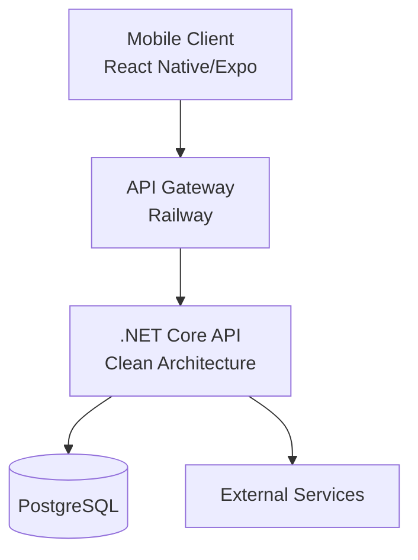

# ✂️ Barber Flow

Barbershop management system with **React Native (Expo)** frontend and **.NET Core 8** backend, deployed on **Railway** with **CI/CD via GitHub Actions**.

[](https://expo.dev)
[](https://reactnative.dev)
[](https://dotnet.microsoft.com)
[](https://railway.app)

---

## 📑 Table of Contents
- [✨ Features](#-features)
- [🏗️ Architecture](#️-architecture)
- [📱 Frontend (Mobile)](#-frontend-mobile)
  - [Prerequisites](#prerequisites)
  - [Installation](#installation)
  - [Running the app](#running-the-app)
  - [Available scripts](#available-scripts)
  - [Folder structure](#folder-structure)
- [🖥️ Backend (API)](#️-backend-api)
  - [Prerequisites](#prerequisites-1)
  - [Installation](#installation-1)
  - [Running the app](#running-the-app-1)
  - [Database](#database)
  - [Folder structure](#folder-structure-1)
- [🔐 Environment Variables](#-environment-variables)
- [🚀 Deployment](#-deployment)
- [🧪 Testing](#-testing)
- [📚 API Documentation](#-api-documentation)
- [🤖 AI-Powered Development](#-ai-powered-development)
- [🤝 Contributing](#-contributing)
- [📄 License](#-license)

---

## ✨ Features

### Frontend
- 📅 Interactive calendar for appointment management
- 👤 User authentication (customers/barbers)
- 🔔 Push notifications
- 🎨 Light/Dark theme system
- 📱 Responsive design for iOS and Android
- ⚡ Global state management with Zustand
- 🧭 Drawer + Stack navigation

### Backend
- 🏛️ Clean Architecture
- 🔐 JWT Authentication
- 📦 Entity Framework Core with PostgreSQL
- ✅ FluentValidation for input validation
- 📄 Swagger documentation
- 🐳 Dockerized for production
- 🔄 CI/CD with GitHub Actions

---

## 🏗️ Architecture



---

## 📱 Frontend (Mobile)

### Prerequisites
- Node.js 18 or higher
- npm or yarn
- Expo CLI (`npm install -g expo-cli`)
- iOS Simulator (Mac only) or Android Emulator
- Expo Go app on your physical device (optional)

### Installation
```bash
# Clone the repository
git clone https://github.com/your-username/barber-flow.git
cd barber-flow/barber-flow-mobile

# Install dependencies
npm install
```

### Running the app
```bash
# Development mode
npm start

# Run on specific platforms
npm run android    # Android emulator/device
npm run ios        # iOS simulator (Mac only)
npm run web        # Web version (limited)

# Different environment modes
npm run dev        # Development
npm run preview    # Pre-production
```

### Available scripts
| Command | Description |
|---------|-------------|
| `npm start` | Start Expo development server |
| `npm run android` | Run on Android |
| `npm run ios` | Run on iOS |
| `npm run web` | Run web version |
| `npm run lint` | Run linter |
| `npm test` | Run tests |
| `npm run build:android` | Production build (APK/AAB) |
| `npm run build:ios` | Production build (IPA) |
| `npm run build:preview` | Pre-production build |

### Folder structure
```
src/
├── components/           # Reusable components
│   ├── calendar/        # Calendar-specific components
│   ├── settings/        # Settings components
│   └── ui/              # Base components (Button, Card, etc.)
├── context/             # React Contexts
│   └── NotificationContext.tsx
├── features/            # Feature-based organization
│   └── appointments/
│       ├── appointment.store.ts
│       └── appointment.types.ts
├── navigation/          # Navigation configuration
│   ├── AppNavigator.tsx
│   └── DrawerNavigation.tsx
├── screens/             # Screens
│   ├── CalendarScreen.tsx
│   ├── CreateAppointmentScreen.tsx
│   ├── NotificationScreen.tsx
│   └── SettingsScreen.tsx
├── services/            # API calls
├── store/               # Global Zustand stores
└── theme/               # Theme system
    ├── fonts.ts
    ├── ThemeContext.tsx
    └── themes.ts
```

---

## 🖥️ Backend (API)

### Prerequisites
- [.NET SDK 8.0](https://dotnet.microsoft.com/download)
- [PostgreSQL](https://www.postgresql.org/download/) (local or Docker)
- [Docker](https://www.docker.com/products/docker-desktop) (optional)

### Installation
```bash
cd barber-flow/barber-flow-api

# Restore dependencies
dotnet restore

# Install EF Core tools (if not installed)
dotnet tool install --global dotnet-ef
```

### Running the app
```bash
# Run in development
dotnet run --project Barber.Flow.Api

# Or from the API folder
cd Barber.Flow.Api
dotnet run

# With hot reload
dotnet watch run
```

### Database
```bash
# Create migration
dotnet ef migrations add InitialCreate --project Barber.Flow.Infrastructure --startup-project Barber.Flow.Api

# Apply migrations
dotnet ef database update --project Barber.Flow.Infrastructure --startup-project Barber.Flow.Api

# Remove migration
dotnet ef migrations remove --project Barber.Flow.Infrastructure --startup-project Barber.Flow.Api
```

### Folder structure
```
Barber.Flow.Api/
├── Barber.Flow.Domain/           # Entities, Enums, Interfaces (no dependencies)
│   └── Entities/
│       ├── Appointment.cs
│       └── User.cs
├── Barber.Flow.Application/       # DTOs, Use Cases, Validators
│   ├── DTOs/
│   ├── Validators/
│   └── Services/
├── Barber.Flow.Infrastructure/    # DbContext, Repositories, Migrations
│   ├── Data/
│   └── Repositories/
└── Barber.Flow.Api/              # Controllers, Middleware, Program.cs
    ├── Controllers/
    ├── Middleware/
    └── Program.cs
```

---

## 🔐 Environment Variables

### Frontend (`.env`)
```env
# API URL (Railway)
EXPO_PUBLIC_API_URL=https://your-api.railway.app/api

# Environment
EXPO_PUBLIC_ENV=development
```

### Backend (`appsettings.json` or Railway)
```json
{
  "ConnectionStrings": {
    "DefaultConnection": "Host=localhost;Port=5432;Database=barberflow;Username=postgres;Password=your_password"
  },
  "Jwt": {
    "Key": "your_very_long_and_secure_secret_key",
    "Issuer": "BarberFlow",
    "Audience": "BarberFlowMobile",
    "ExpiresInMinutes": 60
  },
  "Logging": {
    "LogLevel": {
      "Default": "Information",
      "Microsoft": "Warning"
    }
  }
}
```

---

## 🚀 Deployment

### Frontend (Expo EAS)
```bash
# Install EAS CLI
npm install -g eas-cli

# Configure build
eas build:configure

# Production build
eas build -p android --profile production
eas build -p ios --profile production
```

### Backend (Railway)

The project includes Railway-ready configuration:

1. Connect repository to Railway
2. Configure environment variables in Railway
3. Railway automatically detects the Dockerfile
4. Automatic deployment on push to `main`

**Included files:**
- `Dockerfile` - Container configuration
- `.dockerignore` - Ignored files
- `railway.json` - Railway-specific configuration

### CI/CD (GitHub Actions)
The project includes automated workflow:
- `.github/workflows/deploy.yml`
- Runs tests on every PR
- Deploys to Railway on merge to `main`

---

## 🧪 Testing

### Frontend
```bash
# Run tests
npm test

# Watch mode
npm test -- --watch

# Coverage
npm test -- --coverage
```

### Backend
```bash
# Run all tests
dotnet test

# Tests with coverage
dotnet test --collect:"XPlat Code Coverage"

# View report
reportgenerator -reports:"**/coverage.cobertura.xml" -targetdir:"coveragereport" -reporttypes:Html
```

---

## 📚 API Documentation

Once the backend is running, Swagger documentation is available at:

- Local: `https://localhost:5001/swagger`
- Production: `https://your-api.railway.app/swagger`

**Main endpoints:**
- `POST /api/auth/login` - Authentication
- `POST /api/auth/register` - Registration
- `GET /api/appointments` - List appointments
- `POST /api/appointments` - Create appointment
- `GET /api/appointments/{id}` - Get appointment
- `PUT /api/appointments/{id}` - Update appointment
- `DELETE /api/appointments/{id}` - Delete appointment

---

## 🤖 AI-Powered Development

This project includes **custom instructions for GitHub Copilot** at:

```
.github/copilot-instructions.md
```

This file contains:
- 📁 Exact project structure
- 🎨 Theme system rules
- 🏛️ Clean Architecture patterns
- 🚫 Things to NEVER do
- 📋 Quality checklists

**Recommendation:** Read this file to understand the project's patterns. Copilot will automatically use it to generate consistent code.

### VS Code Configuration
The project includes recommended settings in `.vscode/settings.json`:
```json
{
  "github.copilot.chat.instructions": [
    {
      "file": ".github/copilot-instructions.md"
    }
  ]
}
```

---

## 🤝 Contributing

1. **Fork the repository**
2. **Create a branch** (`git checkout -b feature/new-feature`)
3. **Follow existing patterns** (check `.github/copilot-instructions.md`)
4. **Ensure tests pass** (`npm test` and `dotnet test`)
5. **Commit changes** (`git commit -m 'feat: add new feature'`)
6. **Push to branch** (`git push origin feature/new-feature`)
7. **Open a Pull Request** to `develop`

### Conventions
- **Commits**: Use [Conventional Commits](https://www.conventionalcommits.org/)
  - `feat:` - New feature
  - `fix:` - Bug fix
  - `docs:` - Documentation
  - `style:` - Formatting
  - `refactor:` - Code refactoring
  - `test:` - Tests
  - `chore:` - Maintenance

- **Naming**:
  - Files: `kebab-case.tsx`
  - Components: `PascalCase`
  - Hooks: `camelCase` with `use` prefix
  - Stores: `camelCase.store.ts`

---

## 📄 License

This project is licensed under the **MIT License**. See the `LICENSE` file for details.

---

## 🙏 Acknowledgments

- [Expo](https://expo.dev)
- [React Native](https://reactnative.dev)
- [.NET](https://dotnet.microsoft.com)
- [Railway](https://railway.app)
- [GitHub Copilot](https://github.com/features/copilot)

---

## 📞 Contact

- **Developer**: [Your Name](mailto:your@email.com)
- **Repository**: [github.com/your-username/barber-flow](https://github.com/your-username/barber-flow)
- **Report issues**: [github.com/your-username/barber-flow/issues](https://github.com/your-username/barber-flow/issues)

---

⭐ If you find this project useful, don't forget to give it a star on GitHub!

```
barber.flow.app
├─ .easignore
├─ .expo
│  ├─ devices.json
│  └─ README.md
├─ app.json
├─ barber-flow-api
│  ├─ .env
│  ├─ application-backend-docs
│  │  ├─ GMAIL_SMTP_SETUP.md
│  │  ├─ MONGODB_IMPLEMENTATION.md
│  │  └─ PERFORMANCE_AND_SECURITY_AUDIT.md
│  ├─ Barber.Flow.Api
│  │  ├─ .dockerignore
│  │  ├─ Barber.Flow.Api
│  │  │  ├─ Apis
│  │  │  │  ├─ AppointmentsApi.cs
│  │  │  │  ├─ AuthApi.cs
│  │  │  │  ├─ BarbersApi.cs
│  │  │  │  ├─ BarberShopsApi.cs
│  │  │  │  ├─ ClientsApi.cs
│  │  │  │  ├─ ReportsApi.cs
│  │  │  │  ├─ SampleApi.cs
│  │  │  │  └─ UsersApi.cs
│  │  │  ├─ appsettings.Development.json
│  │  │  ├─ appsettings.json
│  │  │  ├─ appsettings.Production.json
│  │  │  ├─ appsettings.Testing.json
│  │  │  ├─ Barber.Flow.Api.csproj
│  │  │  ├─ Barber.Flow.Api.csproj.user
│  │  │  ├─ Barber.Flow.Api.http
│  │  │  ├─ bin
│  │  │  │  └─ Debug
│  │  │  │     ├─ net8.0
│  │  │  │     └─ net9.0
│  │  │  │        ├─ appsettings.Development.json
│  │  │  │        ├─ appsettings.json
│  │  │  │        ├─ appsettings.Production.json
│  │  │  │        ├─ appsettings.Testing.json
│  │  │  │        ├─ Barber.Flow.Api.deps.json
│  │  │  │        ├─ Barber.Flow.Api.dll
│  │  │  │        ├─ Barber.Flow.Api.exe
│  │  │  │        ├─ Barber.Flow.Api.pdb
│  │  │  │        ├─ Barber.Flow.Api.runtimeconfig.json
│  │  │  │        ├─ Barber.Flow.Api.staticwebassets.endpoints.json
│  │  │  │        ├─ Barber.Flow.Api.staticwebassets.runtime.json
│  │  │  │        ├─ Barber.Flow.Application.dll
│  │  │  │        ├─ Barber.Flow.Application.pdb
│  │  │  │        ├─ Barber.Flow.Domain.dll
│  │  │  │        ├─ Barber.Flow.Domain.pdb
│  │  │  │        ├─ Barber.Flow.Infrastructure.dll
│  │  │  │        ├─ Barber.Flow.Infrastructure.pdb
│  │  │  │        ├─ BouncyCastle.Cryptography.dll
│  │  │  │        ├─ DnsClient.dll
│  │  │  │        ├─ FluentValidation.dll
│  │  │  │        ├─ MailKit.dll
│  │  │  │        ├─ Microsoft.AspNetCore.Authentication.JwtBearer.dll
│  │  │  │        ├─ Microsoft.IdentityModel.Abstractions.dll
│  │  │  │        ├─ Microsoft.IdentityModel.JsonWebTokens.dll
│  │  │  │        ├─ Microsoft.IdentityModel.Logging.dll
│  │  │  │        ├─ Microsoft.IdentityModel.Protocols.dll
│  │  │  │        ├─ Microsoft.IdentityModel.Protocols.OpenIdConnect.dll
│  │  │  │        ├─ Microsoft.IdentityModel.Tokens.dll
│  │  │  │        ├─ Microsoft.OpenApi.dll
│  │  │  │        ├─ MimeKit.dll
│  │  │  │        ├─ MongoDB.Bson.dll
│  │  │  │        ├─ MongoDB.Driver.dll
│  │  │  │        ├─ SharpCompress.dll
│  │  │  │        ├─ Snappier.dll
│  │  │  │        ├─ Swashbuckle.AspNetCore.Swagger.dll
│  │  │  │        ├─ Swashbuckle.AspNetCore.SwaggerGen.dll
│  │  │  │        ├─ Swashbuckle.AspNetCore.SwaggerUI.dll
│  │  │  │        ├─ System.IdentityModel.Tokens.Jwt.dll
│  │  │  │        └─ ZstdSharp.dll
│  │  │  ├─ DTOs
│  │  │  │  ├─ Requests
│  │  │  │  │  ├─ AppointmentRequest.cs
│  │  │  │  │  ├─ AuthRequest.cs
│  │  │  │  │  ├─ BarberRequest.cs
│  │  │  │  │  ├─ BarberRequestValidator.cs
│  │  │  │  │  ├─ BarberSettingsDto.cs
│  │  │  │  │  ├─ BarberShopRequest.cs
│  │  │  │  │  ├─ ClientRequest.cs
│  │  │  │  │  ├─ LoginRequest.cs
│  │  │  │  │  ├─ MoveAppointmentRequest.cs
│  │  │  │  │  └─ PasswordRecoveryRequests.cs
│  │  │  │  └─ Responses
│  │  │  │     ├─ AppointmentResponse.cs
│  │  │  │     ├─ BarberResponse.cs
│  │  │  │     ├─ BarberShopResponse.cs
│  │  │  │     ├─ ClientResponse.cs
│  │  │  │     ├─ ClientStatsResponse.cs
│  │  │  │     ├─ DailyReportResponse.cs
│  │  │  │     └─ UserResponse.cs
│  │  │  ├─ Extensions
│  │  │  │  └─ ApplicationExtensions.cs
│  │  │  ├─ obj
│  │  │  │  ├─ Barber.Flow.Api.csproj.nuget.dgspec.json
│  │  │  │  ├─ Barber.Flow.Api.csproj.nuget.g.props
│  │  │  │  ├─ Debug
│  │  │  │  │  ├─ net8.0
│  │  │  │  │  │  ├─ .NETCoreApp,Version=v8.0.AssemblyAttributes.cs
│  │  │  │  │  │  ├─ Barber.Flow.Api.AssemblyInfo.cs
│  │  │  │  │  │  ├─ Barber.Flow.Api.AssemblyInfoInputs.cache
│  │  │  │  │  │  ├─ Barber.Flow.Api.assets.cache
│  │  │  │  │  │  ├─ Barber.Flow.Api.csproj.AssemblyReference.cache
│  │  │  │  │  │  ├─ Barber.Flow.Api.GeneratedMSBuildEditorConfig.editorconfig
│  │  │  │  │  │  ├─ Barber.Flow.Api.GlobalUsings.g.cs
│  │  │  │  │  │  ├─ ref
│  │  │  │  │  │  └─ refint
│  │  │  │  │  └─ net9.0
│  │  │  │  │     ├─ .NETCoreApp,Version=v9.0.AssemblyAttributes.cs
│  │  │  │  │     ├─ ApiEndpoints.json
│  │  │  │  │     ├─ apphost.exe
│  │  │  │  │     ├─ Barber.F.BB97B182.Up2Date
│  │  │  │  │     ├─ Barber.Flow.Api.AssemblyInfo.cs
│  │  │  │  │     ├─ Barber.Flow.Api.AssemblyInfoInputs.cache
│  │  │  │  │     ├─ Barber.Flow.Api.assets.cache
│  │  │  │  │     ├─ Barber.Flow.Api.csproj.AssemblyReference.cache
│  │  │  │  │     ├─ Barber.Flow.Api.csproj.BuildWithSkipAnalyzers
│  │  │  │  │     ├─ Barber.Flow.Api.csproj.CoreCompileInputs.cache
│  │  │  │  │     ├─ Barber.Flow.Api.csproj.FileListAbsolute.txt
│  │  │  │  │     ├─ Barber.Flow.Api.dll
│  │  │  │  │     ├─ Barber.Flow.Api.GeneratedMSBuildEditorConfig.editorconfig
│  │  │  │  │     ├─ Barber.Flow.Api.genruntimeconfig.cache
│  │  │  │  │     ├─ Barber.Flow.Api.GlobalUsings.g.cs
│  │  │  │  │     ├─ Barber.Flow.Api.MvcApplicationPartsAssemblyInfo.cache
│  │  │  │  │     ├─ Barber.Flow.Api.MvcApplicationPartsAssemblyInfo.cs
│  │  │  │  │     ├─ Barber.Flow.Api.pdb
│  │  │  │  │     ├─ Barber.Flow.Api.sourcelink.json
│  │  │  │  │     ├─ compressed
│  │  │  │  │     │  └─ k3wzcril2t-{0}-w2bs8gey4e-w2bs8gey4e.gz
│  │  │  │  │     ├─ EndpointInfo
│  │  │  │  │     │  ├─ Barber.Flow.Api.json
│  │  │  │  │     │  └─ Barber.Flow.Api.OpenApiFiles.cache
│  │  │  │  │     ├─ hayg5uep.jan~
│  │  │  │  │     ├─ rbcswa.dswa.cache.json
│  │  │  │  │     ├─ ref
│  │  │  │  │     │  └─ Barber.Flow.Api.dll
│  │  │  │  │     ├─ refint
│  │  │  │  │     │  └─ Barber.Flow.Api.dll
│  │  │  │  │     ├─ rjimswa.dswa.cache.json
│  │  │  │  │     ├─ rjsmcshtml.dswa.cache.json
│  │  │  │  │     ├─ rjsmrazor.dswa.cache.json
│  │  │  │  │     ├─ rpswa.dswa.cache.json
│  │  │  │  │     ├─ staticwebassets
│  │  │  │  │     ├─ staticwebassets.build.endpoints.json
│  │  │  │  │     ├─ staticwebassets.build.json
│  │  │  │  │     ├─ staticwebassets.build.json.cache
│  │  │  │  │     ├─ staticwebassets.development.json
│  │  │  │  │     ├─ staticwebassets.references.upToDateCheck.txt
│  │  │  │  │     ├─ staticwebassets.removed.txt
│  │  │  │  │     ├─ staticwebassets.upToDateCheck.txt
│  │  │  │  │     └─ swae.build.ex.cache
│  │  │  │  ├─ project.assets.json
│  │  │  │  ├─ project.nuget.cache
│  │  │  │  ├─ project.packagespec.json
│  │  │  │  ├─ rider.project.model.nuget.info
│  │  │  │  └─ rider.project.restore.info
│  │  │  ├─ Program.cs
│  │  │  ├─ Properties
│  │  │  │  └─ launchSettings.json
│  │  │  └─ wwwroot
│  │  │     └─ privacy-policy
│  │  │        └─ index.html
│  │  ├─ Barber.Flow.Api.slnx
│  │  ├─ Barber.Flow.Application
│  │  │  ├─ Barber.Flow.Application.csproj
│  │  │  ├─ bin
│  │  │  │  └─ Debug
│  │  │  │     ├─ net8.0
│  │  │  │     └─ net9.0
│  │  │  │        ├─ Barber.Flow.Application.deps.json
│  │  │  │        ├─ Barber.Flow.Application.dll
│  │  │  │        ├─ Barber.Flow.Application.pdb
│  │  │  │        ├─ Barber.Flow.Domain.dll
│  │  │  │        └─ Barber.Flow.Domain.pdb
│  │  │  ├─ DTOs
│  │  │  │  └─ LoginResult.cs
│  │  │  ├─ obj
│  │  │  │  ├─ Barber.Flow.Application.csproj.nuget.dgspec.json
│  │  │  │  ├─ Barber.Flow.Application.csproj.nuget.g.props
│  │  │  │  ├─ Debug
│  │  │  │  │  ├─ net8.0
│  │  │  │  │  │  ├─ .NETCoreApp,Version=v8.0.AssemblyAttributes.cs
│  │  │  │  │  │  ├─ Barber.Flow.Application.AssemblyInfo.cs
│  │  │  │  │  │  ├─ Barber.Flow.Application.AssemblyInfoInputs.cache
│  │  │  │  │  │  ├─ Barber.Flow.Application.assets.cache
│  │  │  │  │  │  ├─ Barber.Flow.Application.GeneratedMSBuildEditorConfig.editorconfig
│  │  │  │  │  │  ├─ Barber.Flow.Application.GlobalUsings.g.cs
│  │  │  │  │  │  ├─ ref
│  │  │  │  │  │  └─ refint
│  │  │  │  │  └─ net9.0
│  │  │  │  │     ├─ .NETCoreApp,Version=v9.0.AssemblyAttributes.cs
│  │  │  │  │     ├─ Barber.F.2637CF31.Up2Date
│  │  │  │  │     ├─ Barber.Flow.Application.AssemblyInfo.cs
│  │  │  │  │     ├─ Barber.Flow.Application.AssemblyInfoInputs.cache
│  │  │  │  │     ├─ Barber.Flow.Application.assets.cache
│  │  │  │  │     ├─ Barber.Flow.Application.csproj.AssemblyReference.cache
│  │  │  │  │     ├─ Barber.Flow.Application.csproj.BuildWithSkipAnalyzers
│  │  │  │  │     ├─ Barber.Flow.Application.csproj.CoreCompileInputs.cache
│  │  │  │  │     ├─ Barber.Flow.Application.csproj.FileListAbsolute.txt
│  │  │  │  │     ├─ Barber.Flow.Application.dll
│  │  │  │  │     ├─ Barber.Flow.Application.GeneratedMSBuildEditorConfig.editorconfig
│  │  │  │  │     ├─ Barber.Flow.Application.GlobalUsings.g.cs
│  │  │  │  │     ├─ Barber.Flow.Application.pdb
│  │  │  │  │     ├─ Barber.Flow.Application.sourcelink.json
│  │  │  │  │     ├─ ref
│  │  │  │  │     │  └─ Barber.Flow.Application.dll
│  │  │  │  │     └─ refint
│  │  │  │  │        └─ Barber.Flow.Application.dll
│  │  │  │  ├─ project.assets.json
│  │  │  │  ├─ project.nuget.cache
│  │  │  │  ├─ project.packagespec.json
│  │  │  │  ├─ rider.project.model.nuget.info
│  │  │  │  └─ rider.project.restore.info
│  │  │  └─ Services
│  │  │     ├─ Appointments
│  │  │     │  ├─ AppointmentService.cs
│  │  │     │  └─ IAppointmentService.cs
│  │  │     ├─ Auth
│  │  │     │  ├─ AuthService.cs
│  │  │     │  └─ IAuthService.cs
│  │  │     ├─ Barbers
│  │  │     │  ├─ BarberService.cs
│  │  │     │  └─ IBarberService.cs
│  │  │     ├─ Clients
│  │  │     │  ├─ ClientService.cs
│  │  │     │  └─ IClientService.cs
│  │  │     ├─ Reports
│  │  │     │  ├─ IReportService.cs
│  │  │     │  └─ ReportService.cs
│  │  │     ├─ Sample
│  │  │     │  └─ Queries
│  │  │     │     ├─ ISampleQuery.cs
│  │  │     │     └─ SampleQuery.cs
│  │  │     └─ Users
│  │  │        ├─ IUserService.cs
│  │  │        └─ UserService.cs
│  │  ├─ Barber.Flow.Domain
│  │  │  ├─ Barber.Flow.Domain.csproj
│  │  │  ├─ bin
│  │  │  │  └─ Debug
│  │  │  │     ├─ net8.0
│  │  │  │     └─ net9.0
│  │  │  │        ├─ Barber.Flow.Domain.deps.json
│  │  │  │        ├─ Barber.Flow.Domain.dll
│  │  │  │        └─ Barber.Flow.Domain.pdb
│  │  │  ├─ Entities
│  │  │  │  ├─ Appointments.cs
│  │  │  │  ├─ Barber.cs
│  │  │  │  ├─ BarberShop.cs
│  │  │  │  ├─ Client.cs
│  │  │  │  ├─ DailyReport.cs
│  │  │  │  ├─ PasswordResetToken.cs
│  │  │  │  └─ User.cs
│  │  │  ├─ Interfaces
│  │  │  │  ├─ IAppointmentRepository.cs
│  │  │  │  ├─ IBarberRepository.cs
│  │  │  │  ├─ IBarberShopRepository.cs
│  │  │  │  ├─ IClientRepository.cs
│  │  │  │  ├─ IEmailService.cs
│  │  │  │  ├─ IJwtAuthService.cs
│  │  │  │  ├─ IPasswordResetRepository.cs
│  │  │  │  ├─ IReportRepository.cs
│  │  │  │  └─ IUserRepository.cs
│  │  │  ├─ obj
│  │  │  │  ├─ Barber.Flow.Domain.csproj.nuget.dgspec.json
│  │  │  │  ├─ Barber.Flow.Domain.csproj.nuget.g.props
│  │  │  │  ├─ Debug
│  │  │  │  │  ├─ net8.0
│  │  │  │  │  │  ├─ .NETCoreApp,Version=v8.0.AssemblyAttributes.cs
│  │  │  │  │  │  ├─ Barber.Flow.Domain.AssemblyInfo.cs
│  │  │  │  │  │  ├─ Barber.Flow.Domain.AssemblyInfoInputs.cache
│  │  │  │  │  │  ├─ Barber.Flow.Domain.assets.cache
│  │  │  │  │  │  ├─ Barber.Flow.Domain.GeneratedMSBuildEditorConfig.editorconfig
│  │  │  │  │  │  ├─ Barber.Flow.Domain.GlobalUsings.g.cs
│  │  │  │  │  │  ├─ ref
│  │  │  │  │  │  └─ refint
│  │  │  │  │  └─ net9.0
│  │  │  │  │     ├─ .NETCoreApp,Version=v9.0.AssemblyAttributes.cs
│  │  │  │  │     ├─ Barber.Flow.Domain.AssemblyInfo.cs
│  │  │  │  │     ├─ Barber.Flow.Domain.AssemblyInfoInputs.cache
│  │  │  │  │     ├─ Barber.Flow.Domain.assets.cache
│  │  │  │  │     ├─ Barber.Flow.Domain.csproj.BuildWithSkipAnalyzers
│  │  │  │  │     ├─ Barber.Flow.Domain.csproj.CoreCompileInputs.cache
│  │  │  │  │     ├─ Barber.Flow.Domain.csproj.FileListAbsolute.txt
│  │  │  │  │     ├─ Barber.Flow.Domain.dll
│  │  │  │  │     ├─ Barber.Flow.Domain.GeneratedMSBuildEditorConfig.editorconfig
│  │  │  │  │     ├─ Barber.Flow.Domain.GlobalUsings.g.cs
│  │  │  │  │     ├─ Barber.Flow.Domain.pdb
│  │  │  │  │     ├─ Barber.Flow.Domain.sourcelink.json
│  │  │  │  │     ├─ ref
│  │  │  │  │     │  └─ Barber.Flow.Domain.dll
│  │  │  │  │     └─ refint
│  │  │  │  │        └─ Barber.Flow.Domain.dll
│  │  │  │  ├─ project.assets.json
│  │  │  │  ├─ project.nuget.cache
│  │  │  │  ├─ project.packagespec.json
│  │  │  │  ├─ rider.project.model.nuget.info
│  │  │  │  └─ rider.project.restore.info
│  │  │  └─ ValueObjects
│  │  │     ├─ AuthResult.cs
│  │  │     └─ BarberSettings.cs
│  │  ├─ Barber.Flow.Infrastructure
│  │  │  ├─ Barber.Flow.Infrastructure.csproj
│  │  │  ├─ bin
│  │  │  │  └─ Debug
│  │  │  │     ├─ net8.0
│  │  │  │     └─ net9.0
│  │  │  │        ├─ Barber.Flow.Domain.dll
│  │  │  │        ├─ Barber.Flow.Domain.pdb
│  │  │  │        ├─ Barber.Flow.Infrastructure.deps.json
│  │  │  │        ├─ Barber.Flow.Infrastructure.dll
│  │  │  │        └─ Barber.Flow.Infrastructure.pdb
│  │  │  ├─ obj
│  │  │  │  ├─ Barber.Flow.Infrastructure.csproj.nuget.dgspec.json
│  │  │  │  ├─ Barber.Flow.Infrastructure.csproj.nuget.g.props
│  │  │  │  ├─ Debug
│  │  │  │  │  ├─ net8.0
│  │  │  │  │  │  ├─ .NETCoreApp,Version=v8.0.AssemblyAttributes.cs
│  │  │  │  │  │  ├─ Barber.Flow.Infrastructure.AssemblyInfo.cs
│  │  │  │  │  │  ├─ Barber.Flow.Infrastructure.AssemblyInfoInputs.cache
│  │  │  │  │  │  ├─ Barber.Flow.Infrastructure.assets.cache
│  │  │  │  │  │  ├─ Barber.Flow.Infrastructure.GeneratedMSBuildEditorConfig.editorconfig
│  │  │  │  │  │  ├─ Barber.Flow.Infrastructure.GlobalUsings.g.cs
│  │  │  │  │  │  ├─ ref
│  │  │  │  │  │  └─ refint
│  │  │  │  │  └─ net9.0
│  │  │  │  │     ├─ .NETCoreApp,Version=v9.0.AssemblyAttributes.cs
│  │  │  │  │     ├─ Barber.F.729205DD.Up2Date
│  │  │  │  │     ├─ Barber.Flow.Infrastructure.AssemblyInfo.cs
│  │  │  │  │     ├─ Barber.Flow.Infrastructure.AssemblyInfoInputs.cache
│  │  │  │  │     ├─ Barber.Flow.Infrastructure.assets.cache
│  │  │  │  │     ├─ Barber.Flow.Infrastructure.csproj.AssemblyReference.cache
│  │  │  │  │     ├─ Barber.Flow.Infrastructure.csproj.BuildWithSkipAnalyzers
│  │  │  │  │     ├─ Barber.Flow.Infrastructure.csproj.CoreCompileInputs.cache
│  │  │  │  │     ├─ Barber.Flow.Infrastructure.csproj.FileListAbsolute.txt
│  │  │  │  │     ├─ Barber.Flow.Infrastructure.dll
│  │  │  │  │     ├─ Barber.Flow.Infrastructure.GeneratedMSBuildEditorConfig.editorconfig
│  │  │  │  │     ├─ Barber.Flow.Infrastructure.GlobalUsings.g.cs
│  │  │  │  │     ├─ Barber.Flow.Infrastructure.pdb
│  │  │  │  │     ├─ Barber.Flow.Infrastructure.sourcelink.json
│  │  │  │  │     ├─ ref
│  │  │  │  │     │  └─ Barber.Flow.Infrastructure.dll
│  │  │  │  │     └─ refint
│  │  │  │  │        └─ Barber.Flow.Infrastructure.dll
│  │  │  │  ├─ project.assets.json
│  │  │  │  ├─ project.nuget.cache
│  │  │  │  ├─ project.packagespec.json
│  │  │  │  ├─ rider.project.model.nuget.info
│  │  │  │  └─ rider.project.restore.info
│  │  │  ├─ Services
│  │  │  │  ├─ Auth
│  │  │  │  │  ├─ DTOs
│  │  │  │  │  │  └─ LoginResult.cs
│  │  │  │  │  ├─ InMemoryPasswordResetRepository.cs
│  │  │  │  │  ├─ InMemoryUserRepository.cs
│  │  │  │  │  └─ JwtAuthService.cs
│  │  │  │  ├─ ConsoleEmailService.cs
│  │  │  │  ├─ DataMigrationService.cs
│  │  │  │  ├─ EmailService.cs
│  │  │  │  ├─ InMemory
│  │  │  │  │  ├─ InMemoryAppointmentRepository.cs
│  │  │  │  │  ├─ InMemoryBarberRepository.cs
│  │  │  │  │  ├─ InMemoryBarberShopRepository.cs
│  │  │  │  │  ├─ InMemoryClientRepository.cs
│  │  │  │  │  └─ InMemoryReportRepository.cs
│  │  │  │  └─ MongoDb
│  │  │  │     ├─ MongoDbAppointmentRepository.cs
│  │  │  │     ├─ MongoDbBarberShopRepository.cs
│  │  │  │     ├─ MongoDbBootstrapper.cs
│  │  │  │     ├─ MongoDbClientRepository.cs
│  │  │  │     └─ MongoDbPasswordResetRepository.cs
│  │  │  └─ Settings
│  │  │     ├─ EmailSettings.cs
│  │  │     ├─ FeatureFlags.cs
│  │  │     └─ MongoDbSettings.cs
│  │  ├─ Dockerfile
│  │  └─ tests
│  │     └─ Barber.Flow.Infrastructure.Tests
│  │        ├─ Barber.Flow.Infrastructure.Tests.csproj
│  │        ├─ BarberRepositoryTests.cs
│  │        ├─ bin
│  │        │  └─ Debug
│  │        │     └─ net9.0
│  │        │        ├─ .msCoverageSourceRootsMapping_Barber.Flow.Infrastructure.Tests
│  │        │        ├─ Barber.Flow.Domain.dll
│  │        │        ├─ Barber.Flow.Domain.pdb
│  │        │        ├─ Barber.Flow.Infrastructure.dll
│  │        │        ├─ Barber.Flow.Infrastructure.pdb
│  │        │        ├─ Barber.Flow.Infrastructure.Tests.deps.json
│  │        │        ├─ Barber.Flow.Infrastructure.Tests.dll
│  │        │        ├─ Barber.Flow.Infrastructure.Tests.pdb
│  │        │        ├─ Barber.Flow.Infrastructure.Tests.runtimeconfig.json
│  │        │        ├─ cs
│  │        │        │  ├─ Microsoft.TestPlatform.CommunicationUtilities.resources.dll
│  │        │        │  ├─ Microsoft.TestPlatform.CoreUtilities.resources.dll
│  │        │        │  ├─ Microsoft.TestPlatform.CrossPlatEngine.resources.dll
│  │        │        │  ├─ Microsoft.VisualStudio.TestPlatform.Common.resources.dll
│  │        │        │  └─ Microsoft.VisualStudio.TestPlatform.ObjectModel.resources.dll
│  │        │        ├─ de
│  │        │        │  ├─ Microsoft.TestPlatform.CommunicationUtilities.resources.dll
│  │        │        │  ├─ Microsoft.TestPlatform.CoreUtilities.resources.dll
│  │        │        │  ├─ Microsoft.TestPlatform.CrossPlatEngine.resources.dll
│  │        │        │  ├─ Microsoft.VisualStudio.TestPlatform.Common.resources.dll
│  │        │        │  └─ Microsoft.VisualStudio.TestPlatform.ObjectModel.resources.dll
│  │        │        ├─ es
│  │        │        │  ├─ Microsoft.TestPlatform.CommunicationUtilities.resources.dll
│  │        │        │  ├─ Microsoft.TestPlatform.CoreUtilities.resources.dll
│  │        │        │  ├─ Microsoft.TestPlatform.CrossPlatEngine.resources.dll
│  │        │        │  ├─ Microsoft.VisualStudio.TestPlatform.Common.resources.dll
│  │        │        │  └─ Microsoft.VisualStudio.TestPlatform.ObjectModel.resources.dll
│  │        │        ├─ fr
│  │        │        │  ├─ Microsoft.TestPlatform.CommunicationUtilities.resources.dll
│  │        │        │  ├─ Microsoft.TestPlatform.CoreUtilities.resources.dll
│  │        │        │  ├─ Microsoft.TestPlatform.CrossPlatEngine.resources.dll
│  │        │        │  ├─ Microsoft.VisualStudio.TestPlatform.Common.resources.dll
│  │        │        │  └─ Microsoft.VisualStudio.TestPlatform.ObjectModel.resources.dll
│  │        │        ├─ it
│  │        │        │  ├─ Microsoft.TestPlatform.CommunicationUtilities.resources.dll
│  │        │        │  ├─ Microsoft.TestPlatform.CoreUtilities.resources.dll
│  │        │        │  ├─ Microsoft.TestPlatform.CrossPlatEngine.resources.dll
│  │        │        │  ├─ Microsoft.VisualStudio.TestPlatform.Common.resources.dll
│  │        │        │  └─ Microsoft.VisualStudio.TestPlatform.ObjectModel.resources.dll
│  │        │        ├─ ja
│  │        │        │  ├─ Microsoft.TestPlatform.CommunicationUtilities.resources.dll
│  │        │        │  ├─ Microsoft.TestPlatform.CoreUtilities.resources.dll
│  │        │        │  ├─ Microsoft.TestPlatform.CrossPlatEngine.resources.dll
│  │        │        │  ├─ Microsoft.VisualStudio.TestPlatform.Common.resources.dll
│  │        │        │  └─ Microsoft.VisualStudio.TestPlatform.ObjectModel.resources.dll
│  │        │        ├─ ko
│  │        │        │  ├─ Microsoft.TestPlatform.CommunicationUtilities.resources.dll
│  │        │        │  ├─ Microsoft.TestPlatform.CoreUtilities.resources.dll
│  │        │        │  ├─ Microsoft.TestPlatform.CrossPlatEngine.resources.dll
│  │        │        │  ├─ Microsoft.VisualStudio.TestPlatform.Common.resources.dll
│  │        │        │  └─ Microsoft.VisualStudio.TestPlatform.ObjectModel.resources.dll
│  │        │        ├─ Microsoft.AspNetCore.Authentication.JwtBearer.dll
│  │        │        ├─ Microsoft.IdentityModel.Abstractions.dll
│  │        │        ├─ Microsoft.IdentityModel.JsonWebTokens.dll
│  │        │        ├─ Microsoft.IdentityModel.Logging.dll
│  │        │        ├─ Microsoft.IdentityModel.Protocols.dll
│  │        │        ├─ Microsoft.IdentityModel.Protocols.OpenIdConnect.dll
│  │        │        ├─ Microsoft.IdentityModel.Tokens.dll
│  │        │        ├─ Microsoft.TestPlatform.CommunicationUtilities.dll
│  │        │        ├─ Microsoft.TestPlatform.CoreUtilities.dll
│  │        │        ├─ Microsoft.TestPlatform.CrossPlatEngine.dll
│  │        │        ├─ Microsoft.TestPlatform.PlatformAbstractions.dll
│  │        │        ├─ Microsoft.TestPlatform.Utilities.dll
│  │        │        ├─ Microsoft.VisualStudio.CodeCoverage.Shim.dll
│  │        │        ├─ Microsoft.VisualStudio.TestPlatform.Common.dll
│  │        │        ├─ Microsoft.VisualStudio.TestPlatform.ObjectModel.dll
│  │        │        ├─ Newtonsoft.Json.dll
│  │        │        ├─ pl
│  │        │        │  ├─ Microsoft.TestPlatform.CommunicationUtilities.resources.dll
│  │        │        │  ├─ Microsoft.TestPlatform.CoreUtilities.resources.dll
│  │        │        │  ├─ Microsoft.TestPlatform.CrossPlatEngine.resources.dll
│  │        │        │  ├─ Microsoft.VisualStudio.TestPlatform.Common.resources.dll
│  │        │        │  └─ Microsoft.VisualStudio.TestPlatform.ObjectModel.resources.dll
│  │        │        ├─ pt-BR
│  │        │        │  ├─ Microsoft.TestPlatform.CommunicationUtilities.resources.dll
│  │        │        │  ├─ Microsoft.TestPlatform.CoreUtilities.resources.dll
│  │        │        │  ├─ Microsoft.TestPlatform.CrossPlatEngine.resources.dll
│  │        │        │  ├─ Microsoft.VisualStudio.TestPlatform.Common.resources.dll
│  │        │        │  └─ Microsoft.VisualStudio.TestPlatform.ObjectModel.resources.dll
│  │        │        ├─ ru
│  │        │        │  ├─ Microsoft.TestPlatform.CommunicationUtilities.resources.dll
│  │        │        │  ├─ Microsoft.TestPlatform.CoreUtilities.resources.dll
│  │        │        │  ├─ Microsoft.TestPlatform.CrossPlatEngine.resources.dll
│  │        │        │  ├─ Microsoft.VisualStudio.TestPlatform.Common.resources.dll
│  │        │        │  └─ Microsoft.VisualStudio.TestPlatform.ObjectModel.resources.dll
│  │        │        ├─ System.IdentityModel.Tokens.Jwt.dll
│  │        │        ├─ testhost.dll
│  │        │        ├─ testhost.exe
│  │        │        ├─ tr
│  │        │        │  ├─ Microsoft.TestPlatform.CommunicationUtilities.resources.dll
│  │        │        │  ├─ Microsoft.TestPlatform.CoreUtilities.resources.dll
│  │        │        │  ├─ Microsoft.TestPlatform.CrossPlatEngine.resources.dll
│  │        │        │  ├─ Microsoft.VisualStudio.TestPlatform.Common.resources.dll
│  │        │        │  └─ Microsoft.VisualStudio.TestPlatform.ObjectModel.resources.dll
│  │        │        ├─ xunit.abstractions.dll
│  │        │        ├─ xunit.assert.dll
│  │        │        ├─ xunit.core.dll
│  │        │        ├─ xunit.execution.dotnet.dll
│  │        │        ├─ xunit.runner.reporters.netcoreapp10.dll
│  │        │        ├─ xunit.runner.utility.netcoreapp10.dll
│  │        │        ├─ xunit.runner.visualstudio.dotnetcore.testadapter.dll
│  │        │        ├─ zh-Hans
│  │        │        │  ├─ Microsoft.TestPlatform.CommunicationUtilities.resources.dll
│  │        │        │  ├─ Microsoft.TestPlatform.CoreUtilities.resources.dll
│  │        │        │  ├─ Microsoft.TestPlatform.CrossPlatEngine.resources.dll
│  │        │        │  ├─ Microsoft.VisualStudio.TestPlatform.Common.resources.dll
│  │        │        │  └─ Microsoft.VisualStudio.TestPlatform.ObjectModel.resources.dll
│  │        │        └─ zh-Hant
│  │        │           ├─ Microsoft.TestPlatform.CommunicationUtilities.resources.dll
│  │        │           ├─ Microsoft.TestPlatform.CoreUtilities.resources.dll
│  │        │           ├─ Microsoft.TestPlatform.CrossPlatEngine.resources.dll
│  │        │           ├─ Microsoft.VisualStudio.TestPlatform.Common.resources.dll
│  │        │           └─ Microsoft.VisualStudio.TestPlatform.ObjectModel.resources.dll
│  │        └─ obj
│  │           ├─ Barber.Flow.Infrastructure.Tests.csproj.nuget.dgspec.json
│  │           ├─ Barber.Flow.Infrastructure.Tests.csproj.nuget.g.props
│  │           ├─ Debug
│  │           │  └─ net9.0
│  │           │     ├─ .NETCoreApp,Version=v9.0.AssemblyAttributes.cs
│  │           │     ├─ Barber.F.95866739.Up2Date
│  │           │     ├─ Barber.Flow.Infrastructure.Tests.AssemblyInfo.cs
│  │           │     ├─ Barber.Flow.Infrastructure.Tests.AssemblyInfoInputs.cache
│  │           │     ├─ Barber.Flow.Infrastructure.Tests.assets.cache
│  │           │     ├─ Barber.Flow.Infrastructure.Tests.csproj.AssemblyReference.cache
│  │           │     ├─ Barber.Flow.Infrastructure.Tests.csproj.CoreCompileInputs.cache
│  │           │     ├─ Barber.Flow.Infrastructure.Tests.csproj.FileListAbsolute.txt
│  │           │     ├─ Barber.Flow.Infrastructure.Tests.dll
│  │           │     ├─ Barber.Flow.Infrastructure.Tests.GeneratedMSBuildEditorConfig.editorconfig
│  │           │     ├─ Barber.Flow.Infrastructure.Tests.genruntimeconfig.cache
│  │           │     ├─ Barber.Flow.Infrastructure.Tests.pdb
│  │           │     ├─ Barber.Flow.Infrastructure.Tests.sourcelink.json
│  │           │     ├─ ref
│  │           │     │  └─ Barber.Flow.Infrastructure.Tests.dll
│  │           │     └─ refint
│  │           │        └─ Barber.Flow.Infrastructure.Tests.dll
│  │           ├─ project.assets.json
│  │           └─ project.nuget.cache
│  ├─ docker-compose-OLD.yml
│  ├─ docker-compose.yml
│  └─ mongo-init
├─ barber-flow-mobile
│  └─ Barber.Flow.Mobile
│     ├─ .easignore
│     ├─ .expo
│     │  ├─ devices.json
│     │  ├─ README.md
│     │  └─ web
│     │     └─ cache
│     │        └─ production
│     │           └─ images
│     │              └─ favicon
│     │                 └─ favicon-24272cdaeff82cc5facdaccd982a6f05b60c4504704bbf94c19a6388659880bb-contain-transparent
│     │                    └─ favicon-48.png
│     ├─ app.config.js
│     ├─ app.json.bak
│     ├─ App.tsx
│     ├─ application-docs
│     │  ├─ DATABASE_SCHEMA.md
│     │  ├─ FRONTEND_ARCHITECTURE.md
│     │  ├─ PASSWORD_RECOVERY_PLAN.md
│     │  ├─ SETTINGS_SYNC_IMPLEMENTATION.md
│     │  ├─ STORE_COMPLIANCE_PLAN.md
│     │  └─ STORE_SUBMISSION_CONTENT.md
│     ├─ assets
│     │  ├─ adaptive-icon-old.png
│     │  ├─ adaptive-icon.png
│     │  ├─ favicon.png
│     │  ├─ icon-old.png
│     │  ├─ icon.png
│     │  ├─ images
│     │  │  ├─ barber-flow-background-image.jpg
│     │  │  ├─ client-default.jpg
│     │  │  ├─ login-temporal.jpg
│     │  │  ├─ no-image.jpg
│     │  │  └─ no-photo-available.png
│     │  ├─ splash-icon-old.png
│     │  └─ splash-icon.png
│     ├─ eas.json
│     ├─ eslint.config.js
│     ├─ index.ts
│     ├─ package-lock.json
│     ├─ package.json
│     ├─ src
│     │  ├─ components
│     │  │  ├─ appointments
│     │  │  │  └─ ClientSelectorModal.tsx
│     │  │  ├─ AvatarPicker.tsx
│     │  │  ├─ calendar
│     │  │  │  ├─ AppointmentCard.tsx
│     │  │  │  ├─ AppointmentForm.tsx
│     │  │  │  ├─ AppointmentModal.tsx
│     │  │  │  ├─ CalendarHeader.tsx
│     │  │  │  ├─ CalendarView.tsx
│     │  │  │  └─ DayAppointments.tsx
│     │  │  ├─ ClientAvatar.tsx
│     │  │  ├─ clients
│     │  │  │  ├─ ClientAppointmentHistory.tsx
│     │  │  │  ├─ ClientForm.tsx
│     │  │  │  ├─ ClientListItem.tsx
│     │  │  │  ├─ ClientSearchModal.tsx
│     │  │  │  ├─ ClientsListEmptyState.tsx
│     │  │  │  └─ ClientStatsCard.tsx
│     │  │  ├─ notifications
│     │  │  │  ├─ NotificationEmptyState.tsx
│     │  │  │  ├─ NotificationItemCard.tsx
│     │  │  │  └─ NotificationSection.tsx
│     │  │  ├─ ScreenLayout.tsx
│     │  │  ├─ settings
│     │  │  │  ├─ ApplicationUsersModal.tsx
│     │  │  │  ├─ ManageApplicationUsersForm.tsx
│     │  │  │  ├─ ReportCalculationSettingsForm.tsx
│     │  │  │  ├─ SettingItem.tsx
│     │  │  │  └─ SettingSection.tsx
│     │  │  └─ ui
│     │  │     ├─ AnimatedTabIcon.tsx
│     │  │     ├─ AppDrawerContent.tsx
│     │  │     ├─ FormCard.tsx
│     │  │     ├─ Header.tsx
│     │  │     ├─ PasswordInput.tsx
│     │  │     └─ ScreenTitle.tsx
│     │  ├─ config.ts
│     │  ├─ context
│     │  │  ├─ DialogContext.tsx
│     │  │  ├─ LanguageContext.tsx
│     │  │  └─ NotificationContext.tsx
│     │  ├─ features
│     │  │  ├─ appointments
│     │  │  │  ├─ appointment.store.ts
│     │  │  │  ├─ appointments.types.ts
│     │  │  │  └─ useAppointmentForm.ts
│     │  │  ├─ clients
│     │  │  │  └─ clientForm.ts
│     │  │  ├─ reports
│     │  │  │  └─ dailyReport.ts
│     │  │  └─ settings
│     │  │     ├─ reportCalculationsForm.ts
│     │  │     └─ settingsForm.ts
│     │  ├─ localization
│     │  │  ├─ en.ts
│     │  │  ├─ es.ts
│     │  │  └─ i18n.ts
│     │  ├─ navigation
│     │  │  ├─ AppNavigator.tsx
│     │  │  ├─ CalendarNavigator.tsx
│     │  │  ├─ ClientsNavigator.tsx
│     │  │  ├─ DrawerNavigator.tsx
│     │  │  └─ RootNavigator.tsx
│     │  ├─ screens
│     │  │  ├─ AppointmentFormScreen.tsx
│     │  │  ├─ BarberShopSelectorScreen.tsx
│     │  │  ├─ CalendarScreen.tsx
│     │  │  ├─ ClientFormScreen.tsx
│     │  │  ├─ ClientsScreen.tsx
│     │  │  ├─ DailyReportScreen.tsx
│     │  │  ├─ ForgotPasswordScreen.tsx
│     │  │  ├─ LoginScreen.tsx
│     │  │  ├─ NotificationScreen.tsx
│     │  │  ├─ OtpVerificationScreen.tsx
│     │  │  ├─ ResetPasswordScreen.tsx
│     │  │  └─ SettingsScreen.tsx
│     │  ├─ services
│     │  │  ├─ apis
│     │  │  │  └─ apiClient.ts
│     │  │  ├─ appointmentService.ts
│     │  │  ├─ authService.ts
│     │  │  ├─ barberShopService.ts
│     │  │  ├─ clientHistoryService.ts
│     │  │  ├─ clientService.ts
│     │  │  ├─ notificationService.ts
│     │  │  └─ settingsService.ts
│     │  ├─ store
│     │  │  └─ auth.store.ts
│     │  ├─ theme
│     │  │  ├─ fonts.ts
│     │  │  ├─ ThemeContext.tsx
│     │  │  └─ themes.ts
│     │  ├─ types
│     │  │  ├─ applicationUser.ts
│     │  │  ├─ barberShop.ts
│     │  │  ├─ clients.ts
│     │  │  ├─ notifications.ts
│     │  │  └─ settings.ts
│     │  └─ utils
│     │     ├─ contactActions.ts
│     │     ├─ errors.ts
│     │     └─ formatUtil.ts
│     └─ tsconfig.json
├─ package-lock.json
├─ package.json
└─ README.md

```