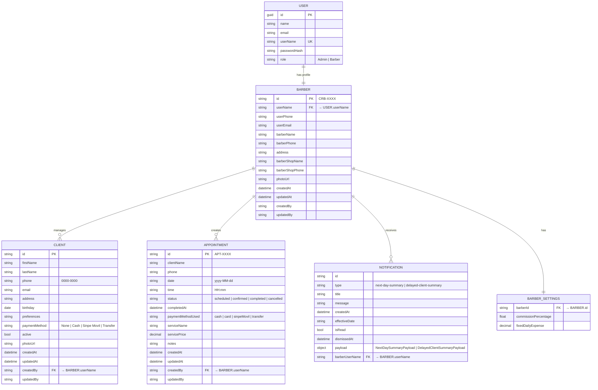

# Barber Flow — Database Schema & Technology Recommendation

## 1. Recommendation: MongoDB

### Why MongoDB over PostgreSQL for this project

| Factor | MongoDB | PostgreSQL on Railway |
|---|---|---|
| **Schema flexibility** | ✅ No migrations needed as features grow | ⚠️ Every change requires a migration |
| **Denormalized appointments** | ✅ Appointments embed `clientName`/`phone` by design — natural fit | ⚠️ Requires either a FK or accepting a hybrid |
| **Embedded sub-documents** | ✅ `DailyReport` embeds `PaymentMethodBreakdown[]` and `CompletedAppointments[]` natively | ⚠️ Needs separate tables or JSONB columns |
| **Polymorphic payloads** | ✅ `NotificationItem.payload` can vary by type — BSON handles this cleanly | ⚠️ Requires JSONB or multiple nullable columns |
| **Barber settings** | ✅ Nested `ReportCalculationSettings` fits as an embedded document | ⚠️ Requires a separate settings table |
| **Railway hosting** | ✅ MongoDB Atlas has a Railway plugin (free M0 tier available) | ✅ Railway native PostgreSQL (excellent DX) |
| **.NET driver** | ✅ Official MongoDB Driver for .NET + `MongoDB.Driver` NuGet | ✅ `Npgsql.EntityFrameworkCore.PostgreSQL` |
| **Startup speed** | ✅ No ORM/migration overhead for early-stage app | ⚠️ EF Core setup, migration history required |

### Verdict
The domain model was already designed in a **document-oriented style**:
- `Appointment` embeds client info (not a FK to `Client`)
- `DailyReport` embeds its breakdown arrays
- `Notification.payload` is polymorphic JSON
- `BarberSettings` wraps nested preference objects

MongoDB on **MongoDB Atlas (Railway plugin)** is the natural fit. The repository interfaces (`IAppointmentRepository`, `IBarberRepository`, etc.) are already in place — replacing `InMemory*` implementations with MongoDB ones requires minimal changes to the domain layer.

> **Railway setup**: Add the **MongoDB Atlas** plugin to your Railway project → it provisions a free M0 cluster and injects `MONGODB_URI` into your service environment variables automatically.

---

## 2. Entity Relationship Diagram



> **Note on CLIENT ↔ APPOINTMENT**: The current design is intentionally denormalized — `Appointment` stores `clientName` and `phone` directly rather than a `clientId` FK. This simplifies queries and aligns with the document model. When a future feature requires linking appointments back to the client profile, add an optional `clientId` field to `Appointment`.

---

## 3. MongoDB Collections

### `users`
```json
{
  "_id": "UUID",
  "name": "John Doe",
  "email": "john@example.com",
  "userName": "johndoe",
  "passwordHash": "$2b$12$...",
  "role": "Admin"
}
```
**Indexes**: `userName` (unique), `email` (unique, sparse)

---

### `barbers`
```json
{
  "_id": "CRB-0001",
  "userName": "johndoe",
  "userPhone": "8888-0000",
  "userEmail": "john@example.com",
  "barberName": "John Doe",
  "barberPhone": "8888-0000",
  "address": "San José, Costa Rica",
  "barberShopName": "The Flow Barbershop",
  "barberShopPhone": "2222-0000",
  "photoUrl": "https://...",
  "settings": {
    "commissionPercentage": 40,
    "fixedDailyExpense": 5000
  },
  "createdAt": "2025-01-01T00:00:00Z",
  "updatedAt": "2025-01-01T00:00:00Z",
  "createdBy": "johndoe",
  "updatedBy": "johndoe"
}
```
> `settings` is embedded in the barber document (avoids a separate collection for a 1:1 relationship).

**Indexes**: `userName` (unique)

---

### `clients`
```json
{
  "_id": "UUID",
  "firstName": "Carlos",
  "lastName": "Pérez",
  "phone": "6000-1234",
  "email": "carlos@example.com",
  "address": "Heredia",
  "birthday": "1990-05-15T00:00:00Z",
  "preferences": "Fade corto",
  "paymentMethod": "Sinpe Movil",
  "active": true,
  "photoUrl": null,
  "createdAt": "2025-01-01T00:00:00Z",
  "updatedAt": "2025-01-01T00:00:00Z",
  "createdBy": "johndoe",
  "updatedBy": "johndoe"
}
```
**Indexes**: `createdBy`, `phone + createdBy` (compound, for deduplication), `active`

---

### `appointments`
```json
{
  "_id": "APT-0001",
  "clientName": "Carlos Pérez",
  "phone": "6000-1234",
  "date": "2025-07-15",
  "time": "09:00",
  "status": "completed",
  "completedAt": "2025-07-15T09:45:00Z",
  "paymentMethodUsed": "sinpeMovil",
  "serviceName": "Fade + Beard",
  "servicePrice": 7500.00,
  "notes": "Cliente prefiere tijera en la parte de arriba",
  "createdAt": "2025-07-14T20:00:00Z",
  "updatedAt": "2025-07-15T09:45:00Z",
  "createdBy": "johndoe",
  "updatedBy": "johndoe"
}
```
**Indexes**:
- `createdBy + date` (compound) — primary query pattern for calendar view
- `date + status` — for report generation
- `createdBy + status` — for appointment list filtering
- `phone + createdBy` — for client history lookups

---

### `notifications`
```json
{
  "_id": "UUID",
  "barberUserName": "johndoe",
  "type": "next-day-summary",
  "title": "Citas para mañana",
  "message": "Tienes 3 citas programadas para el 16 de julio.",
  "createdAt": "2025-07-15T20:00:00Z",
  "effectiveDate": "2025-07-16",
  "isRead": false,
  "dismissedAt": null,
  "payload": {
    "appointmentCount": 3,
    "clientNames": ["Carlos Pérez", "Luis Mora", "Ana Torres"],
    "date": "2025-07-16",
    "route": "Calendar"
  }
}
```
**Indexes**: `barberUserName + isRead`, `barberUserName + effectiveDate`

---

## 4. Derived / Computed Data

### DailyReport (not stored — computed on demand)

`DailyReport` is **generated at query time** by aggregating `appointments` filtered by `date` and `status = "completed"`. It is not persisted in its own collection.

**MongoDB aggregation pipeline** (conceptual):
```
appointments
  → $match { createdBy, date, status: "completed" }
  → $group by paymentMethodUsed
  → $project gross/net/commission from settings
```

If report history is needed in the future, add a `daily_reports` collection to cache computed results per `(barberUserName, date)`.

---

## 5. Future Considerations

| Feature | Schema change |
|---|---|
| **Multi-barber shops** | Add `shopId` to `barbers`, `clients`, `appointments` |
| **Services catalog** | New `services` collection `{ barberId, name, price, duration }` |
| **Client → Appointment link** | Add optional `clientId` field to `appointments` |
| **Appointment history per client** | Index on `phone + createdBy` in `appointments` |
| **Payment receipts / invoices** | New `receipts` collection linked to `appointmentId` |
| **Push notification tokens** | Add `expoPushToken` field to `barbers` |

---

## 6. Railway Setup Steps

1. Open your Railway project dashboard
2. Click **+ New** → **Database** → **MongoDB** (via Atlas plugin or community template)
3. Railway injects `MONGODB_URI` into your API service automatically
4. In `appsettings.json`:
```json
{
  "MongoDB": {
    "ConnectionString": "#{MONGODB_URI}#",
    "DatabaseName": "barber_flow"
  }
}
```
5. Replace `InMemory*` repository implementations with `MongoDB*` implementations using `MongoDB.Driver` NuGet package
6. Connection string is injected securely — never hardcode credentials
