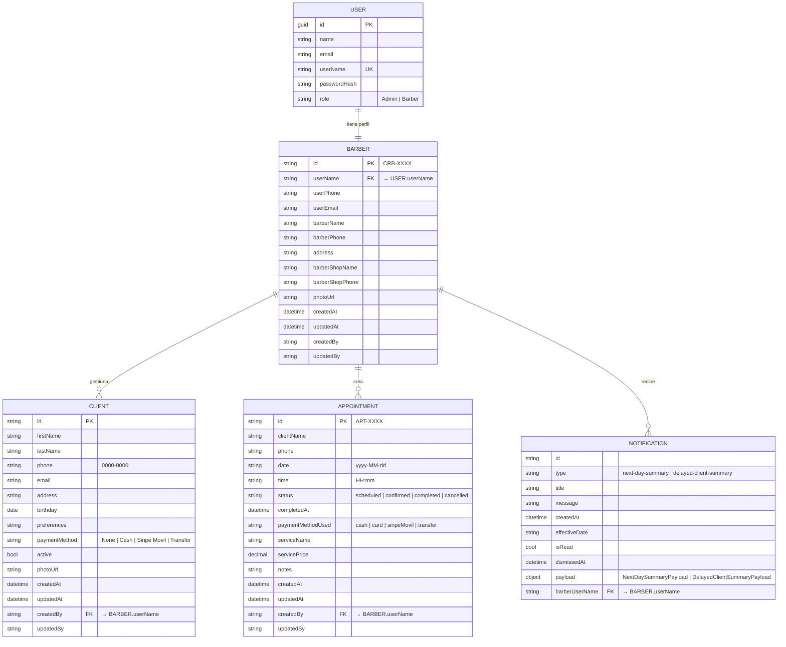

# Barber Flow — Esquema de Base de Datos y Recomendación Tecnológica

## 1. Recomendación: MongoDB

### Por qué MongoDB sobre PostgreSQL para este proyecto

| Factor | MongoDB | PostgreSQL en Railway |
|---|---|---|
| **Flexibilidad de esquema** | ✅ No requiere migraciones a medida que el proyecto crece | ⚠️ Cada cambio requiere una migración |
| **Citas desnormalizadas** | ✅ Las citas embeben `clientName`/`phone` por diseño — encaje natural | ⚠️ Requiere FK o aceptar un modelo híbrido |
| **Sub-documentos embebidos** | ✅ `DailyReport` embebe `PaymentMethodBreakdown[]` y `CompletedAppointments[]` nativamente | ⚠️ Requiere tablas separadas o columnas JSONB |
| **Payloads polimórficos** | ✅ `NotificationItem.payload` puede variar por tipo — BSON lo maneja limpiamente | ⚠️ Requiere JSONB o múltiples columnas nullable |
| **Configuración del barbero** | ✅ `ReportCalculationSettings` anidado encaja como documento embebido | ⚠️ Requiere una tabla de configuración separada |
| **Hosting en Railway** | ✅ MongoDB Atlas tiene plugin para Railway (tier gratuito M0 disponible) | ✅ PostgreSQL nativo en Railway (excelente DX) |
| **Driver .NET** | ✅ Driver oficial de MongoDB para .NET + NuGet `MongoDB.Driver` | ✅ `Npgsql.EntityFrameworkCore.PostgreSQL` |
| **Velocidad de arranque** | ✅ Sin overhead de ORM/migraciones para una app en etapa temprana | ⚠️ Requiere configuración de EF Core e historial de migraciones |

### Veredicto
El modelo de dominio fue diseñado desde el inicio con un **estilo orientado a documentos**:
- `Appointment` embebe la info del cliente (no usa FK a `Client`)
- `DailyReport` embebe sus arrays de desglose
- `Notification.payload` es JSON polimórfico
- `BarberSettings` agrupa objetos de preferencias anidados

MongoDB en **MongoDB Atlas (plugin de Railway)** es el encaje natural. Las interfaces de repositorio (`IAppointmentRepository`, `IBarberRepository`, etc.) ya están implementadas — reemplazar las implementaciones `InMemory*` por implementaciones MongoDB requiere cambios mínimos en la capa de dominio.

> **Configuración en Railway**: Agrega el plugin **MongoDB Atlas** a tu proyecto de Railway → aprovisionará un cluster M0 gratuito e inyectará `MONGODB_URI` en las variables de entorno de tu servicio automáticamente.

---

## 2. Diagrama de Entidad-Relación



> **Nota sobre CLIENT ↔ APPOINTMENT**: El diseño actual está intencionalmente desnormalizado — `Appointment` almacena `clientName` y `phone` directamente en lugar de usar una FK a `clientId`. Esto simplifica las consultas y se alinea con el modelo documental. Cuando se requiera vincular citas al perfil del cliente, se agrega un campo opcional `clientId` a `Appointment`.

---

## 3. Colecciones de MongoDB

### `users`
```json
{
  "_id": "UUID",
  "name": "John Doe",
  "email": "john@example.com",
  "userName": "johndoe",
  "passwordHash": "$2b$12$...",
  "role": "Admin"
}
```
**Índices** *(Planificados — pendientes de `MongoDbUserRepository`)*: `userName` (único), `email` (único, sparse)

---

### `barbers`
```json
{
  "_id": "CRB-0001",
  "userName": "johndoe",
  "userPhone": "8888-0000",
  "userEmail": "john@example.com",
  "barberName": "John Doe",
  "barberPhone": "8888-0000",
  "address": "San José, Costa Rica",
  "barberShopName": "The Flow Barbershop",
  "barberShopPhone": "2222-0000",
  "photoUrl": "https://...",
  "createdAt": "2025-01-01T00:00:00Z",
  "updatedAt": "2025-01-01T00:00:00Z",
  "createdBy": "johndoe",
  "updatedBy": "johndoe"
}
```
> Los campos `commissionPercentage` y `fixedDailyExpense` serán embebidos en este documento cuando se implemente el repositorio MongoDB de barberos (actualmente están hardcodeados en el servicio de reportes).

**Índices** *(Planificados — pendientes de `MongoDbBarberRepository`)*: `userName` (único)

---

### `clients`
```json
{
  "_id": "UUID",
  "firstName": "Carlos",
  "lastName": "Pérez",
  "phone": "6000-1234",
  "email": "carlos@example.com",
  "address": "Heredia",
  "birthday": "1990-05-15T00:00:00Z",
  "preferences": "Fade corto",
  "paymentMethod": "Sinpe Movil",
  "active": true,
  "photoUrl": null,
  "createdAt": "2025-01-01T00:00:00Z",
  "updatedAt": "2025-01-01T00:00:00Z",
  "createdBy": "johndoe",
  "updatedBy": "johndoe"
}
```
**Índices** *(Activos — registrados en `MongoDbBootstrapper.cs`)*: `createdBy`, `phone + createdBy` (compuesto, para deduplicación)

---

### `appointments`
```json
{
  "_id": "APT-0001",
  "clientName": "Carlos Pérez",
  "phone": "6000-1234",
  "date": "2025-07-15",
  "time": "09:00",
  "status": "completed",
  "completedAt": "2025-07-15T09:45:00Z",
  "paymentMethodUsed": "sinpeMovil",
  "serviceName": "Fade + Beard",
  "servicePrice": 7500.00,
  "notes": "Cliente prefiere tijera en la parte de arriba",
  "createdAt": "2025-07-14T20:00:00Z",
  "updatedAt": "2025-07-15T09:45:00Z",
  "createdBy": "johndoe",
  "updatedBy": "johndoe"
}
```
**Índices** *(Planificados — pendientes de `MongoDbAppointmentRepository`)*:
- `createdBy + date` (compuesto) — patrón de consulta principal para la vista de calendario
- `date + status` — para generación de reportes
- `createdBy + status` — para filtrado de lista de citas
- `phone + createdBy` — para historial de citas por cliente

---

### `notifications`

> **Estado**: Pendiente de implementación en el backend. No existe entidad de dominio ni repositorio en el servidor actualmente. La lógica de notificaciones es gestionada en el frontend (estado local de la app).

```json
{
  "_id": "UUID",
  "barberUserName": "johndoe",
  "type": "next-day-summary",
  "title": "Citas para mañana",
  "message": "Tienes 3 citas programadas para el 16 de julio.",
  "createdAt": "2025-07-15T20:00:00Z",
  "effectiveDate": "2025-07-16",
  "isRead": false,
  "dismissedAt": null,
  "payload": {
    "appointmentCount": 3,
    "clientNames": ["Carlos Pérez", "Luis Mora", "Ana Torres"],
    "date": "2025-07-16",
    "route": "Calendar"
  }
}
```
**Índices**: `barberUserName + isRead`, `barberUserName + effectiveDate`

---

### `counters`

Colección interna utilizada para la generación atómica de IDs secuenciales. Garantiza que IDs del tipo `APT-0001`, `CRB-0001`, etc., se asignen sin colisiones en entornos concurrentes mediante `findOneAndUpdate` con `$inc` y `upsert: true`.

```json
{
  "_id": "appointments",
  "seq": 42
}
```

```json
{
  "_id": "clients",
  "seq": 15
}
```

> Esta colección no la gestiona el frontend directamente — el backend la mantiene de forma transparente al crear nuevos documentos.

---

## 4. Datos Derivados / Calculados

### DailyReport (no se almacena — se calcula bajo demanda)

`DailyReport` se **genera en tiempo de consulta** agregando `appointments` filtrados por `date` y `status = "completed"`. No se persiste en su propia colección.

**Pipeline de agregación de MongoDB** (conceptual):
```
appointments
  → $match { createdBy, date, status: "completed" }
  → $group by paymentMethodUsed
  → $project bruto/neto/comisión desde settings
```

Si en el futuro se necesita historial de reportes, agregar una colección `daily_reports` para cachear resultados calculados por `(barberUserName, date)`.

---

## 5. Consideraciones Futuras

| Funcionalidad | Cambio en el esquema |
|---|---|
| **Configuración del barbero (comisión/gastos)** | Agregar campo `settings: { commissionPercentage, fixedDailyExpense }` embebido en `barbers`; actualmente son valores hardcodeados en el servicio de reportes |
| **Repositorio MongoDB — barbers** | Crear `MongoDbBarberRepository` y registrar índices en `MongoDbBootstrapper` |
| **Repositorio MongoDB — appointments** | Crear `MongoDbAppointmentRepository`; patrón documentado en `MONGODB_IMPLEMENTATION.md` §9 |
| **Repositorio MongoDB — notifications** | Crear entidad `Notification`, `INotificationRepository` y su implementación MongoDB |
| **Barberías multi-barbero** | Agregar `shopId` a `barbers`, `clients`, `appointments` |
| **Catálogo de servicios** | Nueva colección `services` `{ barberId, name, price, duration }` |
| **Vínculo Cliente → Cita** | Agregar campo opcional `clientId` a `appointments` |
| **Historial de citas por cliente** | Índice en `phone + createdBy` en `appointments` |
| **Recibos / facturas de pago** | Nueva colección `receipts` vinculada a `appointmentId` |
| **Tokens de notificaciones push** | Agregar campo `expoPushToken` a `barbers` |

---

## 6. Pasos de Configuración en Railway

1. Abre el dashboard de tu proyecto en Railway
2. Haz clic en **+ New** → **Database** → **MongoDB** (via plugin Atlas o template de la comunidad)
3. Railway inyecta `MONGODB_URI` en tu servicio de API automáticamente
4. En `appsettings.json`:
```json
{
  "MongoDB": {
    "ConnectionString": "#{MONGODB_URI}#",
    "DatabaseName": "barber_flow"
  }
}
```
5. Reemplaza las implementaciones `InMemory*` con implementaciones `MongoDB*` usando el paquete NuGet `MongoDB.Driver`
6. El connection string se inyecta de forma segura — nunca hardcodear credenciales
